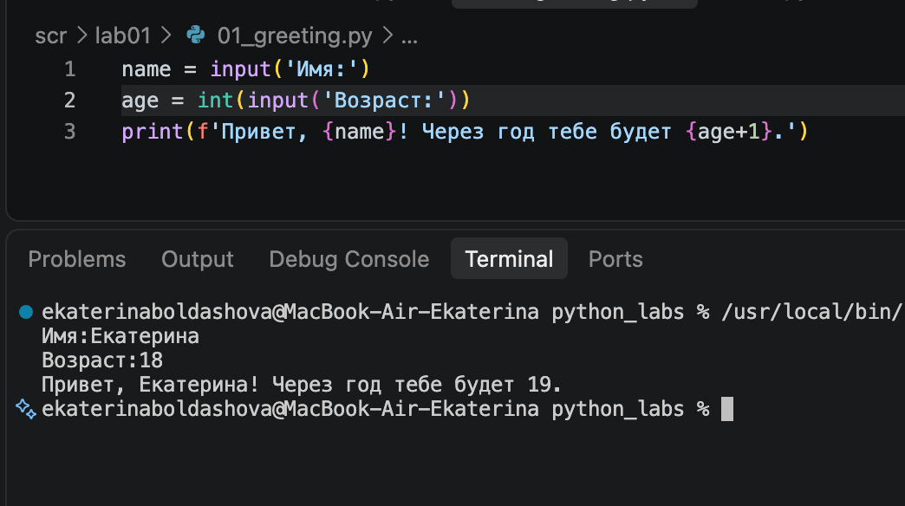
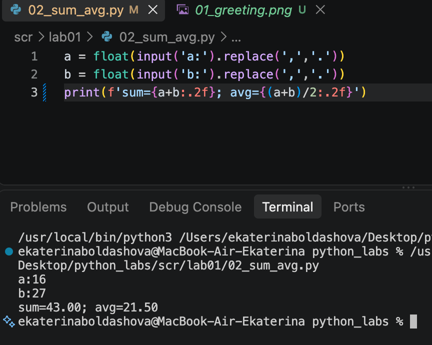
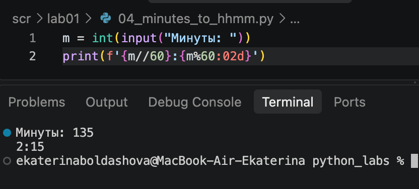
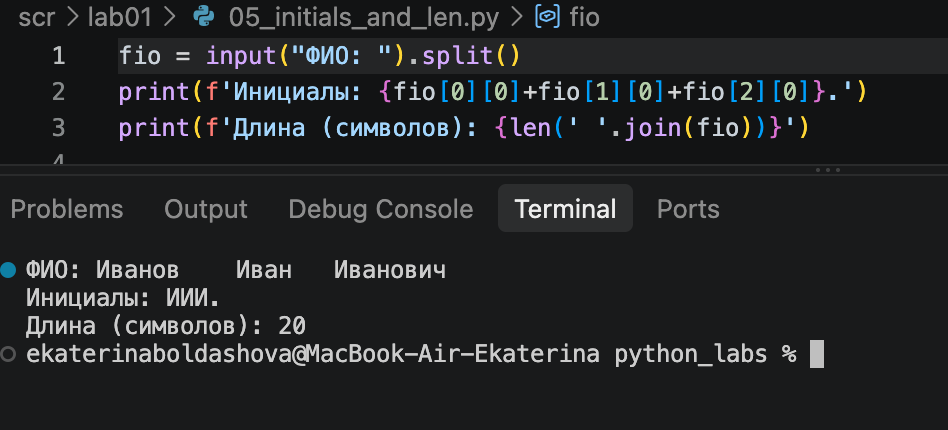
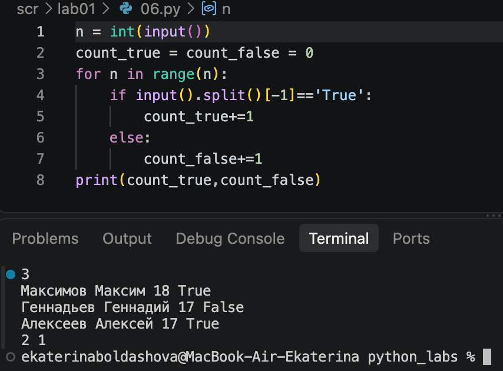
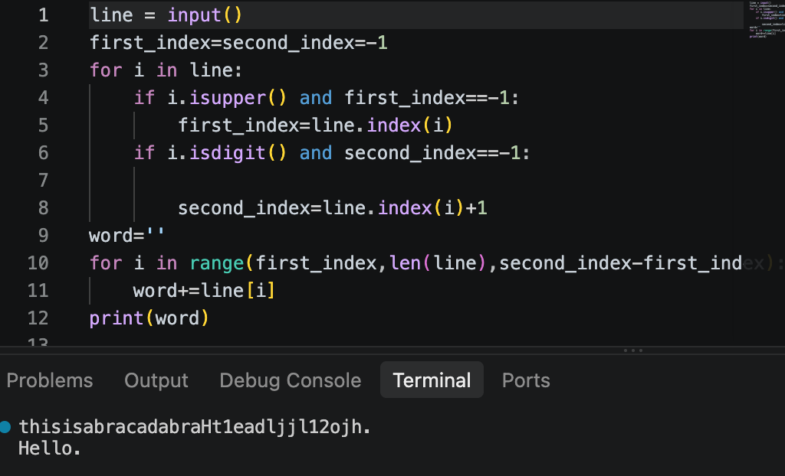

## ЛР1 — Ввод/вывод и форматирование
### Задание 1.

### Задание 2

### Задание 3

вычисляет значения по формулам и выводит строки с равной шириной

### Задание 4

целое от деления на 60- часы, остаток - минуты

### Задание 5

создает список из частей фио, берет срезы

### Задание 6

считывает последнее слово в строках и считает

### Задание 7

запоминает индексы первого и второго символа слова и складывает в единое слово все остальные символы с шагом расстояния между 1-ым и 2-ым

