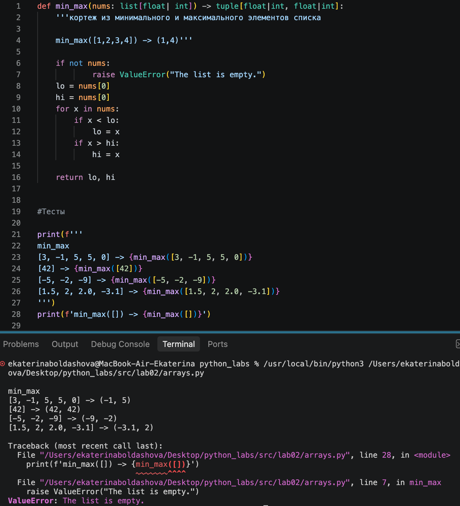
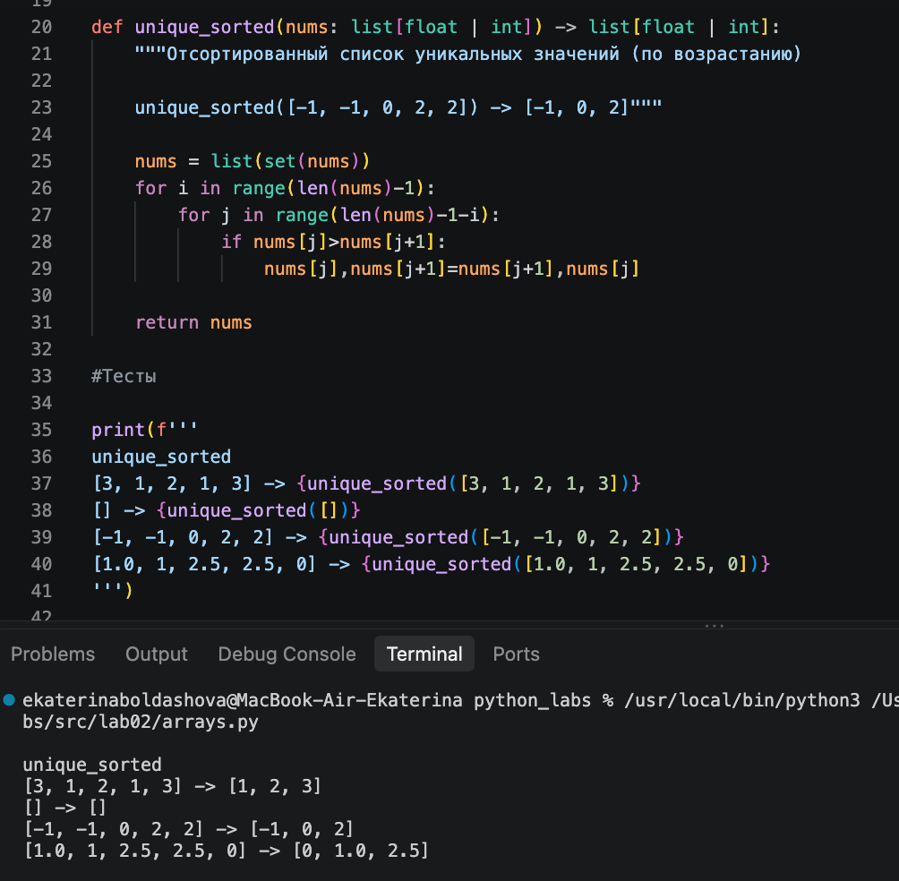
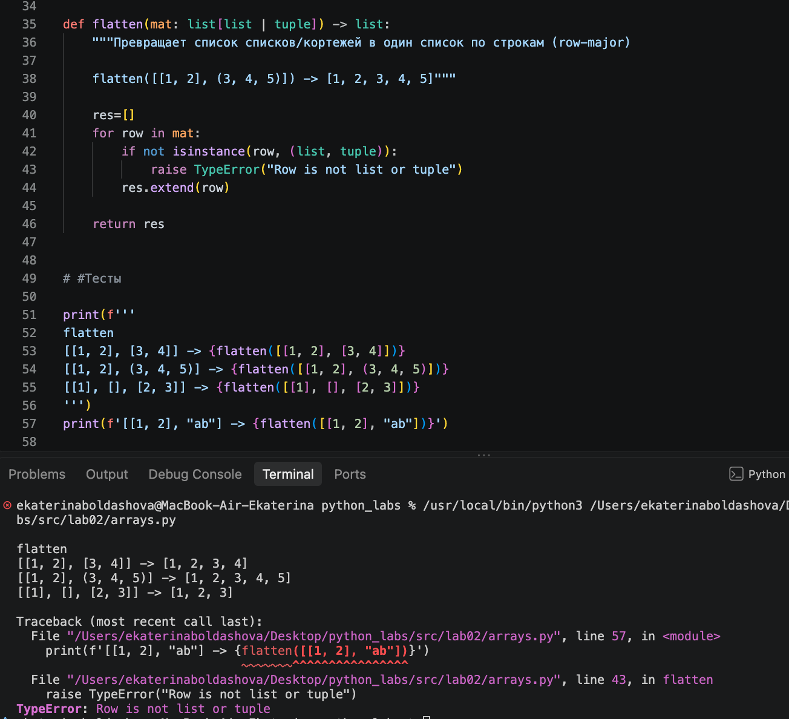
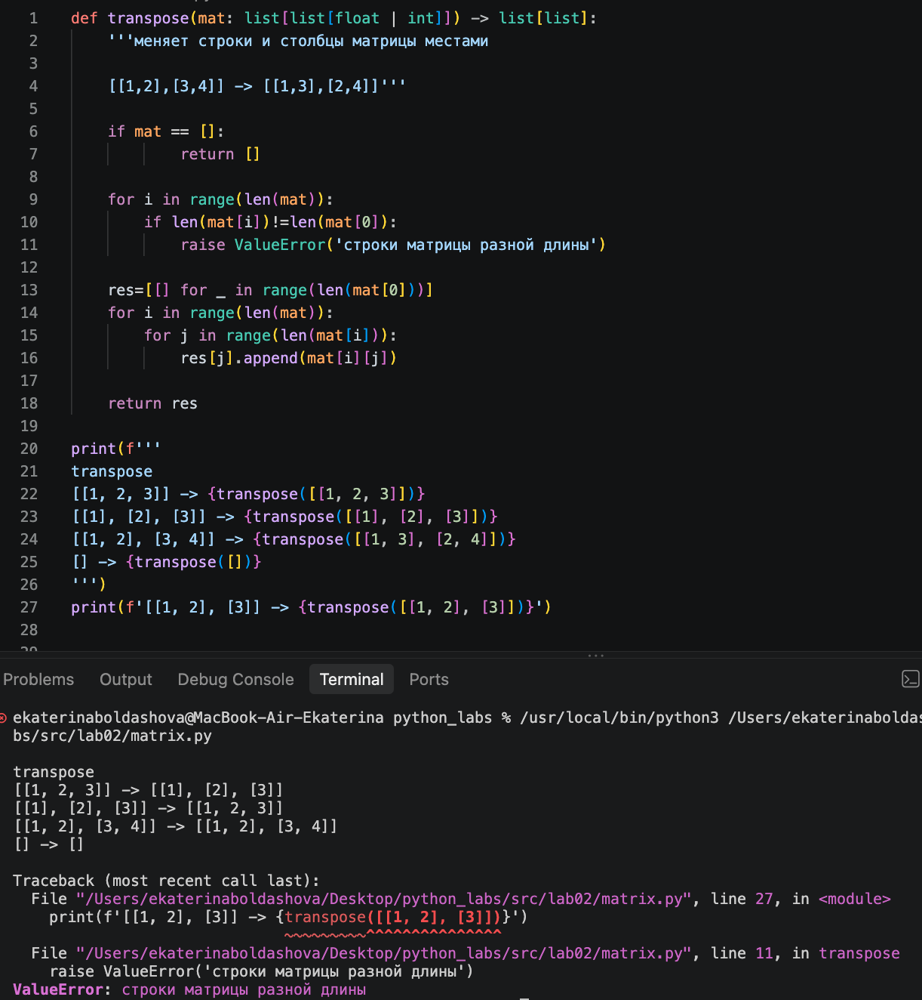
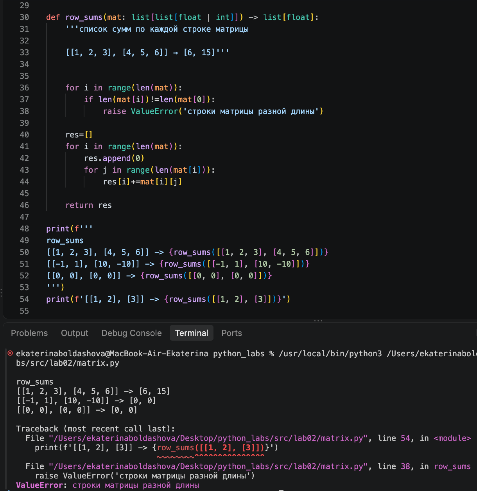
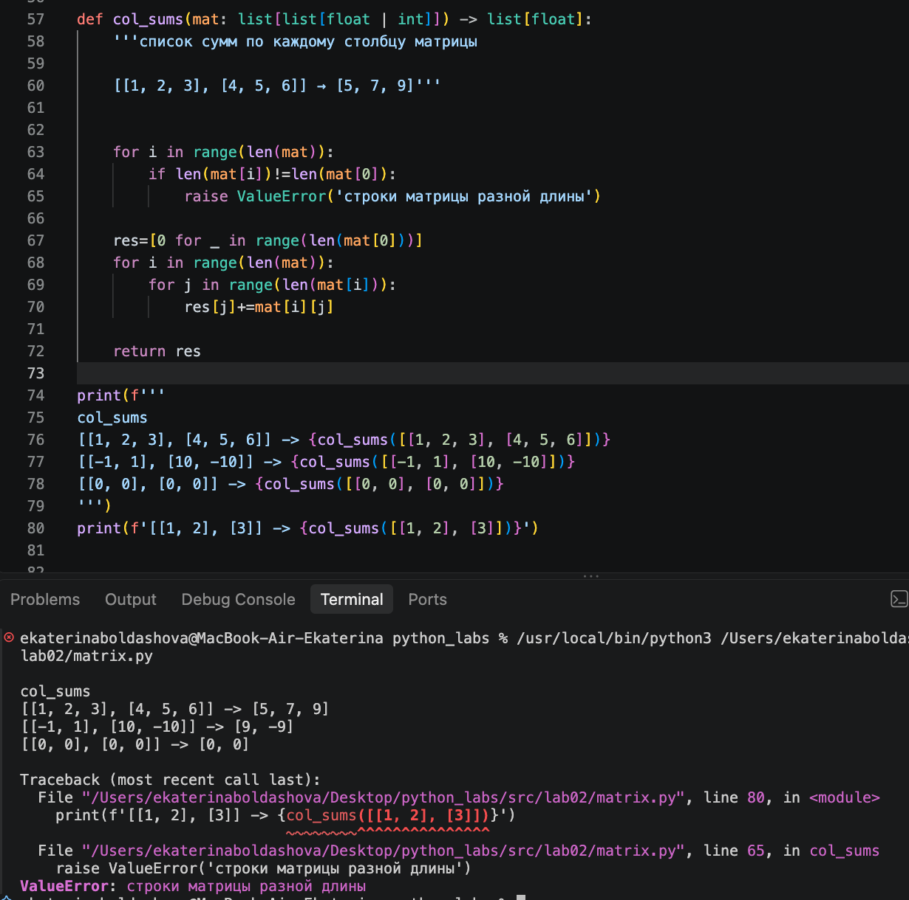
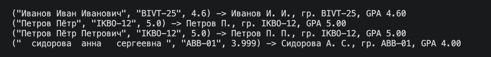

# ЛР1 — Ввод/вывод и форматирование
## Задание A. `arrays.py`

в каждой функции реализована проверка на прямоугольный вид матрицы

1. функция `min_max` возвращает кортеж из минимального и максимального элементов списка

2. функция `unique_sorted` возвращает отсортированный список уникальных значений (по возрастанию)

3. функция `flatten` превращает список списков/кортежей в один список по строкам (row-major)

## Задание B `matrix.py`

1. функция `transpose` меняет строки и столбцы матрицы местами

2. функция `row_sums` возвращает список сумм по каждой строке матрицы

3. функция `unique_sorted` возвращает список сумм по каждому столбцу матрицы

## Задание C

функция `format_record` обрабатывает ошибки при вводе информации и возвращает отформатированную строку вида: `Иванов И.И., гр. BIVT-25, GPA 4.60`
